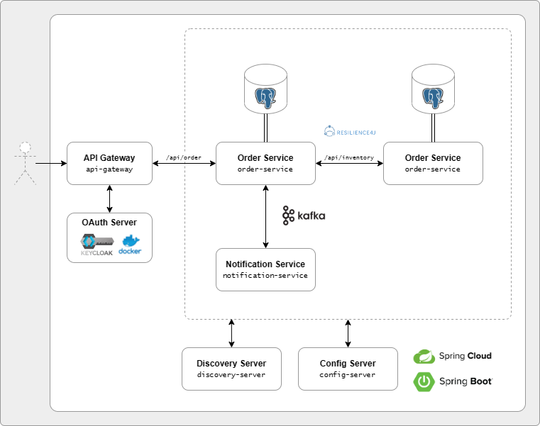

# The Microservices Project

This repo contains a simple, containerised microservice architecture, written in Java and using the Spring framework.

## Architecture overview


+ At this point, the notification service only records logs for each event received. It's only purpose was to provide the foundation of playground to work with Kafka.
+ I have intentionally kept this project single-repo (code & Docker Hub images), even though this is not what I would do for a real application.

## Instructions to use
_The purpose of this project was solely to learn more about the interaction between microservices and ther supporting infrastructure, __not__ to create any meaningful API endpoints._

The following inventory is created for testing purposes:

| Name    | Quantity |
|:--------|:---------|
| Bicycle | 20       |
| Scooter | 100      |
| Car     | 3        |
| Bus     | 0        |


### Place order
POST `api/order`
+ Expects JSON with `customerId` and `orderLineItemDtoList` (containing `name`, `price` and `quantity`)
+ Example:
   ```
   {
       "customerId": 5,
       "orderLineItemDtoList":[
           {
               "name": "Scooter",
               "price": 5000.00,
               "quantity": 1
           }
       ]
   }
   ```
+ If successful, returns HTTP status code `201` and JSON message containing order number - for example:
   ```
   {
      "status": "CREATED",
      "message": "Order placed successfully.",
      "orderNumber": "b835fd6d-052a-4f66-a2a4-8be7181fbcf7"
   }
   ```
+ Depending on error type, returns  `400`, `500`, `503`, or `504` 

###### Notes
- Requests are made to `http://localhost:8181` (requires valid OAUth2.0 token, see 'Generate OAUth 2.0 token with Postman' below)
- pgAdmin is available at `http://localhost:5050` (password: `password`)
- KeyCloak is available at `http://localhost:8080` (username: `admin`, password: `admin`)

## Instructions to run 
### With Docker Compose (recommended)
1. __Clone repo__
2. __Run Docker Compose__
   1. Run `docker compose up -d`
3. __Generate a new client secret__
   1. Go to `http://localhost:8080/` and log into KeyCloak using the username `admin` and password `admin`
   2. Select `Clients`, `microservices-cloud-client`, `Credentials,` and click `Regenerate` in the 'Client Secret' column
   3. Copy the secret to generate a token (see 'Generate OAUth 2.0 token with Postman' below)
4. __Generate token and start sending request__
   1. Generate a valid OAuth2.0 token e.g. with Postman
   2. Using a valid token, you can now send request to `localhost:8181`
   3. You can also use pgAdmin to view the tables at `localhost:5050`
   4. The Eureka discovery server status page is accessible at `localhost:8181/eureka/web`

### Without Docker Compose (_not_ recommended)
Only recommended if you want to expand on this project.
1. __Clone repo__
2. __Create separate repo for configurations__
   1. Manually create second, local Git repo for configuration files
   2. Paste contents of the folder `resources/config-repo-files` into the newly created repo
   3. Add and commit all files to the newly created repo
   4. Open `application.properties` under `config-server/src/main/resources` 
   5. Update `spring.cloud.config.server.git.uri=file://${user.home}/IdeaProjects/Practice-Microservices-Config-Repo/` to reflect the correct path of the newly created repo
3. __Set credentials...__ 
   1. ...for your local __Postgres database__ by (a) replacing variables in `application.properties` in config repo with the actual credentials or (b) injecting them as environmental variables when starting services
   2. ...for the __discovery server__  repeat (a) or (b) above (default credentials are `eureka` / `password`)
4. __Set up KeyCloak on Docker__
   1. Follow the steps provided by [KeyCloak - Getting Started on Docker](https://www.keycloak.org/getting-started/getting-started-docker) to set up KeyCloak as a Docker image
   2. Use default configuration with the following exceptions:
      1. Make sure to set the port to `8181` or update the `api-gateway.properties` file accordingly
      2. When creating a client, set `client authentication` to `On` and enable `Service accounts roles`
      3. When creating a client, disable `Standard flow` and `Direct access grants`
5. __Configure properties file for Jib__
   1. Open `properties.gradle` in the root folder of the project and update your DockerHub credentials, or
   2. Add a new file `local.properties` in your `.gradle/` folder with your DockerHub credentials
6. __Build all services and run them in the following order:__ 
   1. `discovery-server`
   2. `config-server`
   3. `api-gateway`
   4. All other services
7. __Generate token and start sending request__
   1. You can now use Postman or other apps to send request
   2. Make sure to send your requests with a valid OAuth2.0 token

###### Notes
Without further modification (and when __not__ using Docker Compose), ports used by default are:
1. `8080` - `api-gateway`
2. `8761` - `discovery-server`
3. `8181` - KeyCloak Docker image 

Ports for all other services will be assigned and controlled by the discovery server. As a result, all requests to business services must be made through `localhost:8080`.

## Generate a valid OAUth2.0 token with Postman
+ Create a new request
+ Select `Authorization` and set the following:
  + Access token URL = `http://keycloak:8080/realms/practice-microservices-realm/protocol/openid-connect/token`
  + Client ID = `microservices-cloud-client`
  + Client Secret (follow steps above to generate from KeyCloak admin portal)
  + Scope = `openid offline_access`
+ Click `Get New Access Token`
